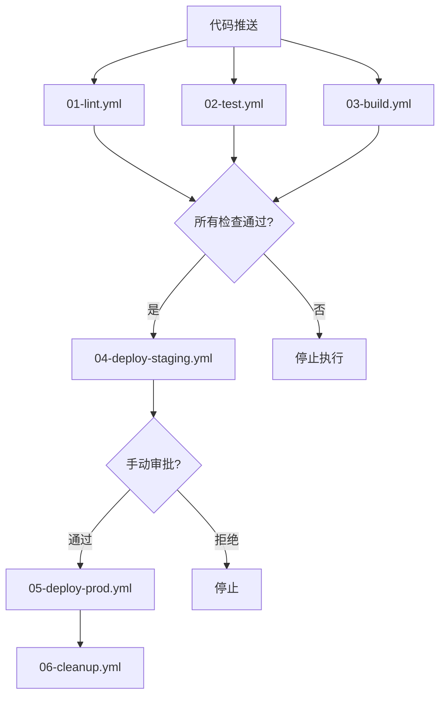

# GitHub Actions 执行顺序示例

## 📁 项目结构
```
.github/
└── workflows/
    ├── 01-lint.yml          # 代码检查
    ├── 02-test.yml          # 单元测试  
    ├── 03-build.yml         # 构建应用
    ├── 04-deploy-staging.yml # 部署到 staging
    ├── 05-deploy-prod.yml   # 部署到生产环境
    └── 06-cleanup.yml       # 清理任务
```

## 🔄 执行流程图



## 📄 工作流文件详解

### 1. 代码检查 (01-lint.yml)
```yaml
name: 01 - Code Lint
on:
  push:
    branches: [ main, develop ]
  pull_request:
    branches: [ main ]

jobs:
  lint:
    runs-on: ubuntu-latest
    steps:
    - name: 检出代码
      uses: actions/checkout@v4
      
    - name: 设置 Node.js
      uses: actions/setup-node@v4
      with:
        node-version: '18'
        cache: 'npm'
        
    - name: 安装依赖
      run: npm ci
      
    - name: 运行 ESLint
      run: npm run lint
      
    - name: 运行 Prettier 检查
      run: npm run format:check
```

### 2. 单元测试 (02-test.yml)
```yaml
name: 02 - Unit Tests
on:
  push:
    branches: [ main, develop ]
  pull_request:
    branches: [ main ]

jobs:
  test:
    runs-on: ubuntu-latest
    strategy:
      matrix:
        node-version: [16, 18, 20]
        
    steps:
    - name: 检出代码
      uses: actions/checkout@v4
      
    - name: 设置 Node.js ${{ matrix.node-version }}
      uses: actions/setup-node@v4
      with:
        node-version: ${{ matrix.node-version }}
        cache: 'npm'
        
    - name: 安装依赖
      run: npm ci
      
    - name: 运行测试
      run: npm run test:coverage
      
    - name: 上传覆盖率报告
      if: matrix.node-version == 18
      uses: codecov/codecov-action@v3
```

### 3. 构建应用 (03-build.yml)
```yaml
name: 03 - Build Application
on:
  push:
    branches: [ main, develop ]
  pull_request:
    branches: [ main ]

jobs:
  build:
    runs-on: ubuntu-latest
    
    steps:
    - name: 检出代码
      uses: actions/checkout@v4
      
    - name: 设置 Node.js
      uses: actions/setup-node@v4
      with:
        node-version: '18'
        cache: 'npm'
        
    - name: 安装依赖
      run: npm ci
      
    - name: 构建应用
      run: npm run build
      
    - name: 上传构建产物
      uses: actions/upload-artifact@v3
      with:
        name: build-${{ github.sha }}
        path: dist/
        retention-days: 7
```

### 4. 部署到 Staging (04-deploy-staging.yml)
```yaml
name: 04 - Deploy to Staging
on:
  workflow_run:
    workflows: 
      - "01 - Code Lint"
      - "02 - Unit Tests" 
      - "03 - Build Application"
    types: [completed]
    branches: [develop]

jobs:
  check-prerequisites:
    runs-on: ubuntu-latest
    outputs:
      should-deploy: ${{ steps.check.outputs.result }}
    steps:
    - name: 检查前置条件
      id: check
      uses: actions/github-script@v6
      with:
        script: |
          // 获取所有相关的工作流运行结果
          const workflows = ['01 - Code Lint', '02 - Unit Tests', '03 - Build Application'];
          const results = [];
          
          for (const workflow of workflows) {
            const runs = await github.rest.actions.listWorkflowRunsForRepo({
              owner: context.repo.owner,
              repo: context.repo.repo,
              workflow_id: `${workflow}.yml`,
              head_sha: context.sha,
              per_page: 1
            });
            
            if (runs.data.workflow_runs.length > 0) {
              results.push(runs.data.workflow_runs[0].conclusion === 'success');
            } else {
              results.push(false);
            }
          }
          
          const allSuccess = results.every(r => r === true);
          console.log('所有前置工作流状态:', results);
          console.log('是否可以部署:', allSuccess);
          
          return allSuccess;

  deploy-staging:
    runs-on: ubuntu-latest
    needs: check-prerequisites
    if: needs.check-prerequisites.outputs.should-deploy == 'true'
    environment: staging
    
    steps:
    - name: 检出代码
      uses: actions/checkout@v4
      
    - name: 下载构建产物
      uses: actions/download-artifact@v3
      with:
        name: build-${{ github.sha }}
        path: dist/
        
    - name: 部署到 Staging
      run: |
        echo "部署到 Staging 环境"
        echo "构建 SHA: ${{ github.sha }}"
        # 实际部署命令
        # rsync -avz dist/ user@staging-server:/var/www/app/
        
    - name: 健康检查
      run: |
        sleep 30
        curl -f https://staging.example.com/health || exit 1
        
    - name: 通知部署结果
      if: always()
      run: |
        if [ "${{ job.status }}" = "success" ]; then
          echo "✅ Staging 部署成功"
        else
          echo "❌ Staging 部署失败"
        fi
```

### 5. 部署到生产环境 (05-deploy-prod.yml)
```yaml
name: 05 - Deploy to Production
on:
  workflow_run:
    workflows: ["04 - Deploy to Staging"]
    types: [completed]
    branches: [main]

jobs:
  deploy-production:
    runs-on: ubuntu-latest
    if: ${{ github.event.workflow_run.conclusion == 'success' }}
    environment: 
      name: production
      url: https://example.com
    
    steps:
    - name: 检出代码
      uses: actions/checkout@v4
      
    - name: 等待手动审批
      uses: trstringer/manual-approval@v1
      with:
        secret: ${{ secrets.GITHUB_TOKEN }}
        approvers: admin,team-lead
        minimum-approvals: 1
        issue-title: "生产环境部署审批 - ${{ github.sha }}"
        issue-body: |
          请审批以下部署请求：
          
          **分支**: ${{ github.ref_name }}
          **提交**: ${{ github.sha }}
          **提交信息**: ${{ github.event.head_commit.message }}
          **提交者**: ${{ github.event.head_commit.author.name }}
          
          **Staging 环境测试**: ✅ 通过
          **部署时间**: $(date)
          
    - name: 下载构建产物
      uses: actions/download-artifact@v3
      with:
        name: build-${{ github.sha }}
        path: dist/
        
    - name: 部署到生产环境
      run: |
        echo "部署到生产环境"
        echo "构建 SHA: ${{ github.sha }}"
        # 实际部署命令
        # rsync -avz dist/ user@prod-server:/var/www/app/
        
    - name: 健康检查
      run: |
        sleep 60
        curl -f https://example.com/health || exit 1
        
    - name: 发送部署通知
      if: always()
      uses: 8398a7/action-slack@v3
      with:
        status: ${{ job.status }}
        channel: '#deployments'
        text: |
          🚀 生产环境部署 ${{ job.status == 'success' && '成功' || '失败' }}
          
          **项目**: ${{ github.repository }}
          **分支**: ${{ github.ref_name }}
          **提交**: ${{ github.sha }}
          **状态**: ${{ job.status == 'success' && '✅ 成功' || '❌ 失败' }}
        webhook_url: ${{ secrets.SLACK_WEBHOOK }}
```

### 6. 清理任务 (06-cleanup.yml)
```yaml
name: 06 - Cleanup
on:
  workflow_run:
    workflows: ["05 - Deploy to Production"]
    types: [completed]
  schedule:
    - cron: '0 3 * * *'  # 每天凌晨3点执行清理

jobs:
  cleanup-artifacts:
    runs-on: ubuntu-latest
    
    steps:
    - name: 清理旧的构建产物
      uses: actions/github-script@v6
      with:
        script: |
          const artifacts = await github.rest.actions.listArtifactsForRepo({
            owner: context.repo.owner,
            repo: context.repo.repo,
            per_page: 100
          });
          
          const oldArtifacts = artifacts.data.artifacts.filter(artifact => {
            const createdAt = new Date(artifact.created_at);
            const weekAgo = new Date();
            weekAgo.setDate(weekAgo.getDate() - 7);
            return createdAt < weekAgo;
          });
          
          console.log(`找到 ${oldArtifacts.length} 个需要清理的构建产物`);
          
          for (const artifact of oldArtifacts) {
            await github.rest.actions.deleteArtifact({
              owner: context.repo.owner,
              repo: context.repo.repo,
              artifact_id: artifact.id
            });
            console.log(`已删除构建产物: ${artifact.name}`);
          }
          
  cleanup-caches:
    runs-on: ubuntu-latest
    
    steps:
    - name: 清理旧的缓存
      uses: actions/github-script@v6
      with:
        script: |
          const caches = await github.rest.actions.getActionsCacheList({
            owner: context.repo.owner,
            repo: context.repo.repo,
            per_page: 100
          });
          
          const oldCaches = caches.data.actions_caches.filter(cache => {
            const createdAt = new Date(cache.created_at);
            const weekAgo = new Date();
            weekAgo.setDate(weekAgo.getDate() - 7);
            return createdAt < weekAgo;
          });
          
          console.log(`找到 ${oldCaches.length} 个需要清理的缓存`);
          
          for (const cache of oldCaches) {
            await github.rest.actions.deleteActionsCacheById({
              owner: context.repo.owner,
              repo: context.repo.repo,
              cache_id: cache.id
            });
            console.log(`已删除缓存: ${cache.key}`);
          }
```

## 🎯 执行顺序总结

### 并行执行阶段
```
推送代码到 develop 分支
    ↓
┌─────────────────┐  ┌─────────────────┐  ┌─────────────────┐
│  01-lint.yml    │  │  02-test.yml    │  │  03-build.yml   │
│  (代码检查)      │  │  (单元测试)      │  │  (构建应用)      │
└─────────────────┘  └─────────────────┘  └─────────────────┘
```

### 串行执行阶段
```
所有前置工作流成功
    ↓
┌─────────────────────┐
│ 04-deploy-staging   │
│ (部署到 Staging)     │
└─────────────────────┘
    ↓
推送到 main 分支
    ↓
┌─────────────────────┐
│ 05-deploy-prod      │
│ (部署到生产环境)      │
└─────────────────────┘
    ↓
┌─────────────────────┐
│ 06-cleanup          │
│ (清理任务)           │
└─────────────────────┘
```

## 🔧 控制执行的方法

### 1. 条件执行
```yaml
jobs:
  deploy:
    if: github.ref == 'refs/heads/main' && success()
```

### 2. 手动触发
```yaml
on:
  workflow_dispatch:
    inputs:
      environment:
        description: '选择部署环境'
        required: true
        default: 'staging'
        type: choice
        options:
        - staging
        - production
```

### 3. 路径过滤
```yaml
on:
  push:
    paths:
      - 'src/**'
      - 'package.json'
    paths-ignore:
      - 'docs/**'
      - '*.md'
```

### 4. 分支过滤
```yaml
on:
  push:
    branches: [ main, 'release/*' ]
    branches-ignore: [ 'feature/*' ]
```

## 📊 监控执行状态

可以通过 GitHub API 或 Actions 面板监控所有工作流的执行状态：

```bash
# 使用 GitHub CLI 查看工作流状态
gh run list --limit 10
gh run view <run-id>
gh run watch <run-id>
```

这样的设计确保了：
- **并行提高效率** - 独立任务同时执行
- **串行保证顺序** - 依赖任务按序执行  
- **条件控制流程** - 根据结果决定后续步骤
- **环境隔离部署** - 先测试后生产
- **自动化清理** - 定期清理资源

**关键点**：文件名不决定执行顺序，`on` 触发条件和 `needs`/`workflow_run` 依赖关系才是决定因素！ 